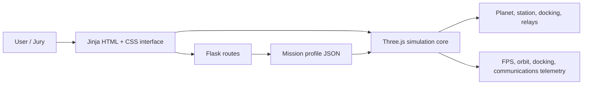

# Architecture / Архитектура

## English

This project is a browser-first digital twin prototype for a modular orbital
station. Flask serves the pages and the mission profile JSON, while the
interactive scene runs in the browser with Three.js and WebGL.

### Runtime layers

- `app.py`: Flask routing, shared navigation, public mission profile data,
  user-story metrics, architecture data and healthcheck.
- `templates/`: server-rendered pages for the landing view, simulator,
  metrics and architecture.
- `static/js/digital_twin.js`: Three.js scene, orbital model, docking model,
  relay visibility, telemetry updates and bilingual simulator text.
- `static/js/ui_animations.js`: global language switch and fold-card
  animations for non-simulator pages.
- `static/css/`: page styling and simulator-specific interface rules.

### Architecture decisions

- Browser-native WebGL keeps the prototype easy to run on Windows, macOS and
  Linux without a game-engine build step.
- The station, relays and most technical objects are procedural geometry, so no
  third-party copyrighted station model is required.
- The backend exposes `/api/mission-profile` as JSON to make the simulator data
  inspectable and reusable.
- The current orbital model is circularized and educational. TLE is documented
  as a compatible reference format; operational tracking is intentionally out of
  scope for this prototype.
- External 3D assets, if added later, should use glTF or OBJ and be documented
  with source and license.

## Русский

Проект устроен как веб-прототип цифрового двойника модульной орбитальной
станции. Flask отдаёт страницы и JSON-профиль миссии, а интерактивная сцена
работает в браузере на Three.js/WebGL.

### Слои

- `app.py`: маршруты Flask, общая навигация, профиль миссии, метрики,
  архитектурные данные и healthcheck.
- `templates/`: страницы главного экрана, симулятора, метрик и архитектуры.
- `static/js/digital_twin.js`: 3D-сцена, орбитальная модель, стыковка,
  ретрансляторы, телеметрия и тексты RU/EN.
- `static/js/ui_animations.js`: глобальное переключение языка и анимации
  раскрывающихся карточек.
- `static/css/`: стили страниц и интерфейса симулятора.

### Принятые решения

- WebGL в браузере снижает порог запуска и поддерживает кроссплатформенность.
- Геометрия станции и ретрансляторов создаётся процедурно, чтобы не зависеть от
  закрытых или спорных 3D-моделей.
- `/api/mission-profile` отдаёт данные в JSON и помогает проверять проект.
- Текущая орбитальная модель упрощена для учебного realtime-сценария; TLE
  зафиксирован как совместимый формат, а не как поток оперативного слежения.
